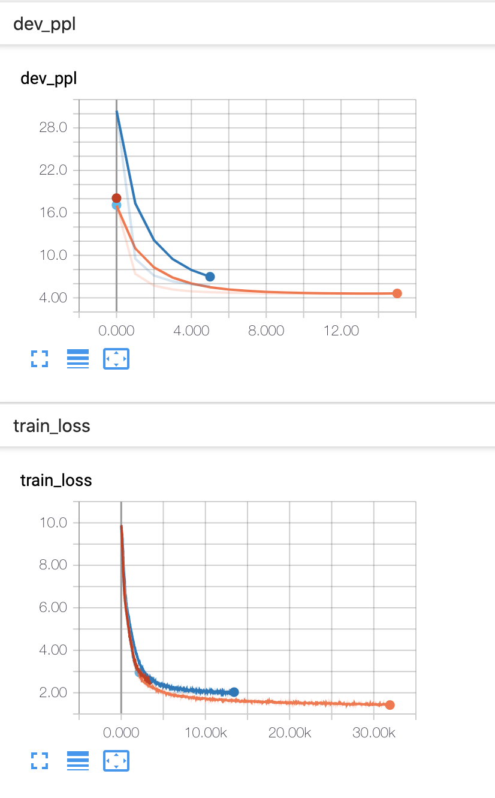

[](https://coveralls.io/github/ljmzlh/transformer?branch=master)
[](https://travis-ci.com/ljmzlh/transformer)

# Transformer(Pytorch)


A Transformer language model in pytorch.

You can refer to the following paper for details:

Ashish Vaswani, Noam Shazeer, Niki Parmar, Jakob Uszkoreit, Llion Jones, Aidan N. Gomez, LukaszKaiser, and Illia Polosukhin. Attention is all you need, 2017.
arXiv:1706.03762.

## Require Packages

* **python3**
* CoTK >= 0.1.0
* pytorch >= 1.3.1
* tensorboardX >= 1.4

## Quick Start

* Install ``CoTK`` following [instructions](https://github.com/thu-coai/cotk#installation).
* Using ... to download codes.
* Prepare dataset. Data should be named as 
  * opensub_pair_train.en/de
  * opensub_pair_dev.en/de
  * opensub_pair_test.en/de
* Execute ``python run.py`` to train the model.
  * If you don't have GPUs, you can add `-no_cuda` for switching to CPU, but it may cost very long time for either training or test.
* You can view training process by tensorboard, the log is at `./runs`.
  * For example, ``tensorboard --logdir=./runs``. (You have to install tensorboard first.)
* After training, execute  ``python run.py -mode test -restore MODEL_PATH`` for test.
  * MODEL_PATH is the path of the checkpoint to load
* Find results at ``./output``.

## Arguments

```none
usage: run.py [-mode MODE] [-restore RESTORE] [-datapath DATAPATH]
              [-epoch EPOCH] [-b BATCH_SIZE]
              [-grad_step GRAD_STEP] [-save_steps SAVE_STEPS]
              [-lr LR] [-d_model D_MODEL]
              [-d_inner_hid D_INNER_HID] 
              [-d_k D_K] [-d_v D_V]
              [-n_head N_HEAD] [-n_layers N_LAYERS]
              [-warmup WARMUP] [-dropout DROPOUT] 
              [-no_cuda]

optional arguments:
  -mode MODE            "train" or "test"
                        Default: train
  -restore RESOTRE      The path of the checkpoint you want to load. 
                        Use it to resume training or test a checkpoint.
                        Default: None
  -datapath DATAPATH    The path of dataset.
                        Default: ./dataset
  -epoch EPOCH          Epoch for training. 
                        Default: 100
  -b BATCH_SIZE         Batch size. 
                        Default: 2048
  -grad_step GRAD_STEP  Optimizer will step once per GRAD_STEP batches.
                        Use it on condition that GPU memory is limited.
                        Defult: 1
  -save_step SAVE_STEP  Make a checkpoint every SAVE_STEP steps during training.
                        Default: 1000
  -lr LR                Learning rate will be LR*lrate.
                        Refer to section 5.3 in the paper for the definition of lrate.
                        Default: 1
  -d_model D_MODEL      Size of vector in Transformer.
                        Default: 512
  -d_inner D_inner      Size of hidden fc layer.
                        Default: 2048
  -d_k D_K              Size of vector k,q in self-attention.
                        Default: 64
  -d_v D_V              Size of vector v in self-attention.
                        Default: 64
  -n_head N_HEAD        N_HEAD heads in multi-head attention. 
                        Assert d_model=n_head*d_v
                        Default: 8
  -n_layer N_LAYER      N_LAYER encoder/decoder layers in encoder/decoder.
                        Default: 6
  -warmup WARMUP        Warm up steps of optimizer.
                        Default: 4000
  -dropout DROPOUT      The probability to be zeroed in     dropout. 
                        0 indicates for don't use dropout.
                        Default: 0.1
  -no_cuda              Use CPU.
```

## Tensorboard Example

Excute ```tensorboard --logdir=./runs```
You will see plot below</br>

<div align=left>
	
</div>

</br>

You can see train loss and dev ppl during training.


## Performance

Performance on newstest2013(dev).
[ Train until dev ppl stops decreasing or for 10 epochs]

 &ensp; | N |  d_model | d_inner  | n_head | d_k | d_v | dropout | PPL | BLEU(%)
-|-|-|-|-|-|-|-|-|-
base | 6 | 512 | 2048 | 8 | 64| 64 |0.1 | 4.54 | 27.2
&ensp; |  |  |  | 1 | 512 | 512 | | 6.34| 22.1
&ensp; | 2 |  |  |  | |  | | 5.30 | 26.1
&ensp; |  | 256 |  |  | |  | | 4.48 | 26.9
&ensp; |  |  |  |  | |  |0 | 4.51 | 26.8
&ensp; |  |  |  | | |  |0.2 | 4.31 | 27.8


## Author


